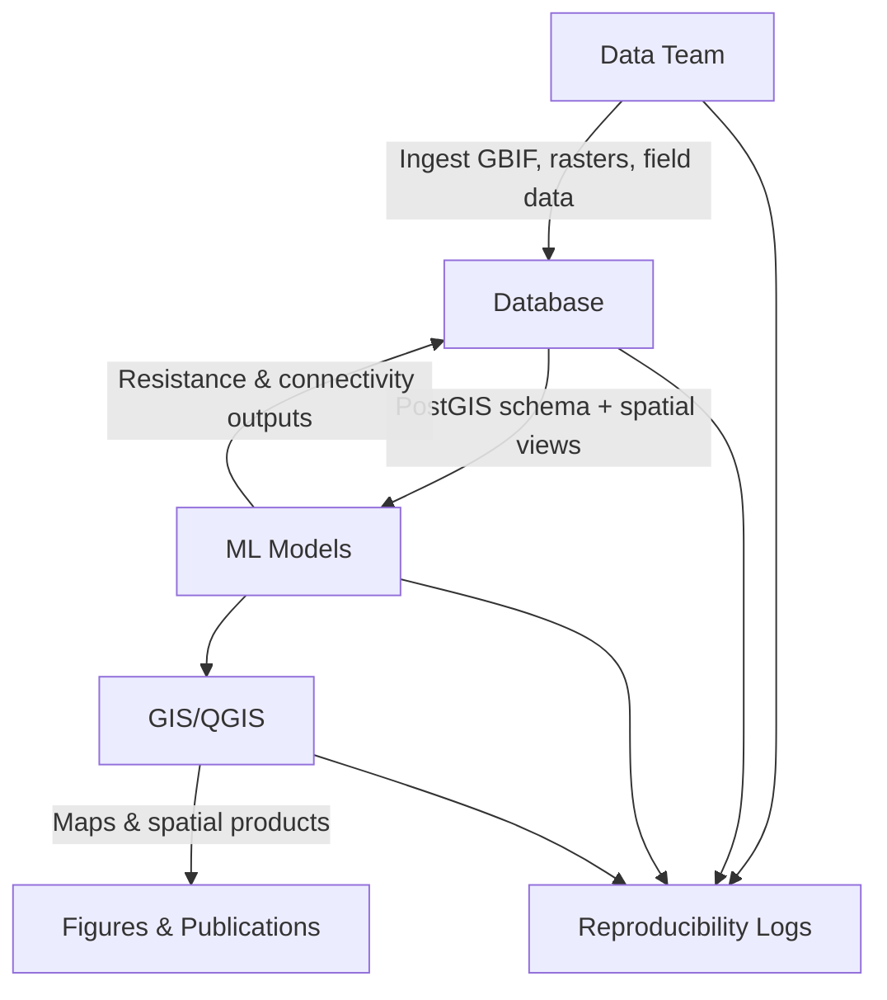

# COA Connectivity Lab — `data-management` (active here)

A modular, reproducible workflow for modelling ecological connectivity, integrating database management, machine learning, GIS visualisation, and biodiversity data ingestion.


## Overview

The **Eco Connectivity Workflow** is a modular GitHub-based research stack designed to support scalable, reproducible ecological connectivity modelling.

It enables multiple teams to work in parallel while maintaining full provenance tracking, reproducibility, and interoperability across all stages of the pipeline.

The system transforms raw biodiversity and environmental data into:

* connectivity maps
* resistance surfaces
* spatial conservation products

---

## The Modular Stack

| Module                   | Purpose                                                         | Repository                                                                                                                   |
| ------------------------ | --------------------------------------------------------------- | ---------------------------------------------------------------------------------------------------------------------------- |
| **Database**             | PostgreSQL/PostGIS schema and workflow views                    | [https://github.com/coa-connectivity-lab/db-schema](https://github.com/coa-connectivity-lab/db-schema)                       |
| **Machine Learning**     | Resistance modelling and connectivity analysis                  | [https://github.com/coa-connectivity-lab/ml-models](https://github.com/coa-connectivity-lab/ml-models)                       |
| **GIS Projects**         | QGIS projects, styles, and cartographic outputs                 | [https://github.com/coa-connectivity-lab/qgis-projects](https://github.com/coa-connectivity-lab/qgis-projects)               |
| **Data Management**      | GBIF ingestion, raster preprocessing, and species harmonisation | [https://github.com/coa-connectivity-lab/data-management](https://github.com/coa-connectivity-lab/data-management)           |
| **Reproducibility Logs** | Scenario tracking, outputs, and execution provenance            | [https://github.com/coa-connectivity-lab/reproducibility-logs](https://github.com/coa-connectivity-lab/reproducibility-logs) |

---

## System Architecture



---

## Reproducibility

This project is now fully reproducible using:

* Julia 1.10+
* `Pkg` environment manager
* System-installed GDAL/PROJ libraries
* Ubuntu CA certificate store

No external environment managers (such as Guix) are required.

---

## Setup (Julia environment)

```bash
cd omniscape-stack
julia setup.jl
```

Then run:

```bash
julia run_omniscape.jl
```

Expected output:

```
✔ Omniscape environment loaded successfully
```

---

## Notes

* Ensure system packages are installed:

```bash
sudo apt install gdal-bin libgdal-dev proj-bin libproj-dev
```

* Ensure SSL certificates are available:

```
/etc/ssl/certs/ca-certificates.crt
```

---

## Summary

This repository now follows a **standard, system-native Julia workflow** with no dependency on Guix or external environment managers, improving reproducibility, portability, and long-term maintainability across research systems.
