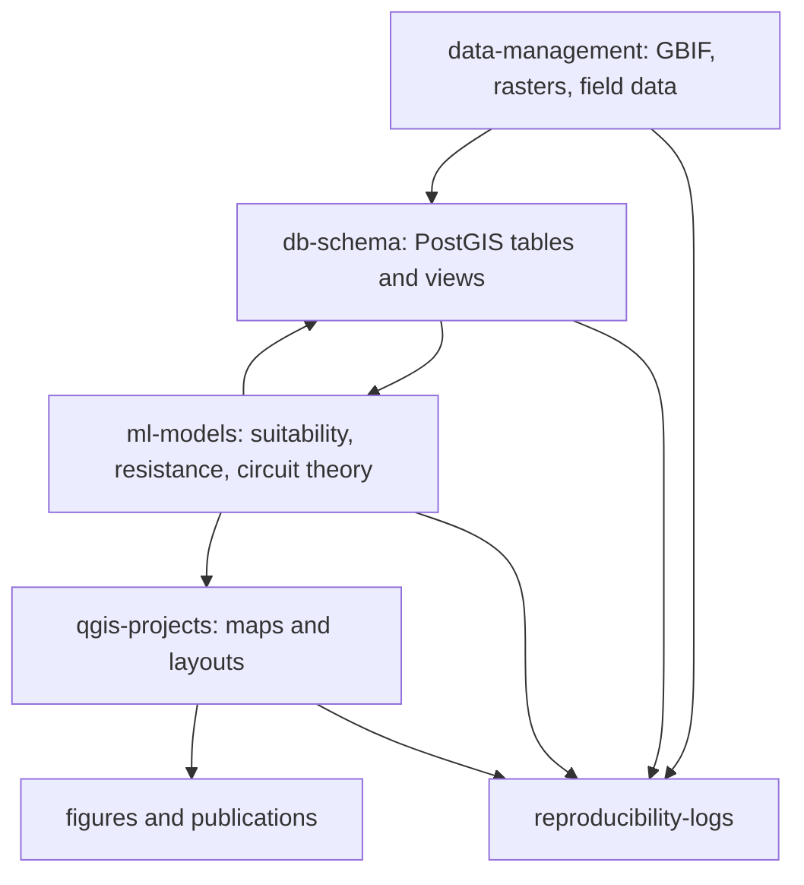

# Greater Côa Valley eco-connectivity workflow

**A reproducible, pure-Python pipeline for ecological connectivity analysis in
resource-limited rewilding projects. The Greater Côa Valley, Portugal, is the
worked case study.**

## What this is

This repository is the entry point to a small modular stack for modelling
ecological connectivity from open data. It began as a solo baseline study for
[Rewilding Portugal](https://rewilding-portugal.com/)'s Greater Côa Valley
programme, built from GBIF occurrence records and the
[Spatial Thoughts](https://spatialthoughts.com/) PyQGIS and Python tutorials. It is
now being opened up so that collaborators can turn it into a pipeline other
rewilding and restoration teams can pick up and run on their own landscapes.

One constraint shapes every choice here. A resource-limited conservation
organisation should be able to reproduce the whole analysis on a laptop, with a
standard scientific Python environment, no specialist runtime, no paid services,
and no cluster.

## Why pure Python

The first prototype used Julia with Omniscape.jl, managed through Guix. Getting
that combination to build the same way on more than one machine took more effort
than the science did: certificate-path conflicts, registry-clone failures over
HTTPS, and a toolchain most partner organisations could not realistically support.
That route is written up, and abandoned, in
[`docs/decisions/0001-python-not-julia.md`](docs/decisions/0001-python-not-julia.md).

The pipeline now uses:

- (i) **Python** for every processing step: pandas, geopandas, rioxarray and
  xarray, scikit-learn, and a `scipy.sparse` moving-window solver for circuit
  theory in place of Circuitscape or Omniscape.jl;
- (ii) **PostgreSQL with PostGIS** as the spatial data store, and the layer that
  lets several people work against the same tables;
- (iii) **QGIS** for styling, map layouts, and cartographic output, driven from
  PyQGIS so the maps rebuild without manual steps.

No component needs a licence fee. Everything installs from conda-forge or apt.

## Method

The connectivity model follows Prima et al. (2024),
*A comprehensive framework to assess multi-species landscape connectivity*
(*Methods in Ecology and Evolution*): functional grouping, then a suitability model
and a resistance surface per group, then circuit theory, then a protected-area
overlay. Here the groups are organised by movement medium rather than taxonomy.

| Group | Species | Search radius set by |
| --- | --- | --- |
| Land | Iberian wolf, European wildcat, red deer | wolf, 80 km |
| Water | Eurasian otter, Iberian nase, calandino, European pond turtle | otter, 20 km |
| Air | griffon vulture, Egyptian vulture, golden eagle | vultures, 100 km |

Resistance surfaces for the Land and Water groups also carry a fire-history penalty
(NASA MODIS MCD64A1.061 burned area, 2015 onward, via Microsoft Planetary
Computer), field-observed barriers from a shared Survey123 form, and a UNESCO
heritage-conflict layer. The study area is a 30 km buffer around the Côa mainstem
plus its traced tributary catchment, on a 100 m grid in EPSG:3035.

## Honest about limits

This is a reproducibility contribution, not a methodological advance. The pipeline
states its own weak points rather than smoothing them over:

- Random Forest accuracy figures are in-sample fit, not out-of-sample validation.
  There is no movement-tracking data to test against.
- The Land group rests on very few occurrence points, roughly 42 usable, so its
  surface is thin.
- The Air group's near-uniform suitability most likely reflects citizen-science
  recording density, not habitat preference.
- Some flagship species named in Rewilding Portugal's own reporting (European
  beaver, Sorraia horse, Tauros) are not modelled here.

## The modular stack

Each part lives in its own repository so teams can work in parallel. This
repository holds the shared documentation, the demo, and the contribution rules.

| Module | Purpose | Repository |
| --- | --- | --- |
| Data management | GBIF ingestion, covariate rasters, species harmonisation | `coa-connectivity-lab/data-management` |
| Database | PostgreSQL/PostGIS schema and spatial views | `coa-connectivity-lab/db-schema` |
| ML models | Suitability models, resistance transform, circuit solver | `coa-connectivity-lab/ml-models` |
| QGIS projects | PyQGIS project builders, styles, layouts | `coa-connectivity-lab/qgis-projects` |
| Reproducibility logs | Scenario tracking, run provenance, outputs | `coa-connectivity-lab/reproducibility-logs` |

```mermaid
flowchart TD
    A[data-management: GBIF, rasters, field data] --> B[db-schema: PostGIS tables and views]
    B --> C[ml-models: suitability, resistance, circuit theory]
    C --> B
    C --> D[qgis-projects: maps and layouts]
    D --> E[figures and publications]
    A --> F[reproducibility-logs]
    B --> F
    C --> F
    D --> F
```

## Data handling

- No data files in Git. Every layer is downloaded by a script from a cited source,
  or built by a documented step.
- Sensitive-species locations, currently the European wildcat, are generalised to
  a 5 km grid cell before they reach any figure, map, or export.
- Raw GBIF downloads are cached and referenced by their download DOI.

## Reproducing the baseline

Full instructions land here as the module repositories are populated. The shape of
it: create the conda environment, start a local PostGIS instance, run the
`acquire_*` scripts to pull open data, run the `build_*` scripts to produce
suitability and resistance surfaces, run the circuit solver, then build the QGIS
project. One entry script runs the chain end to end.

## Getting involved

The Git workflow, the review rules, and the AI-assistance disclosure convention are
in [`CONTRIBUTING.md`](CONTRIBUTING.md). Roles and how decisions get made are in
[`GOVERNANCE.md`](GOVERNANCE.md). A step-by-step guide to getting access and
opening a first change is in [`docs/onboarding.md`](docs/onboarding.md).

This pipeline is being built with code generated by Claude and reviewed by the
team, so the workflow is deliberately strict about review, provenance, and
recording what a human checked and how. If you run a rewilding or restoration
project that needs a connectivity analysis and cannot take on a heavy software
stack, that is exactly the case this is being built for. What would you need it to
do differently on your landscape?

Linda Angulo Lopez, September 2026

## Licence

MIT. See [`LICENSE`](LICENSE).
